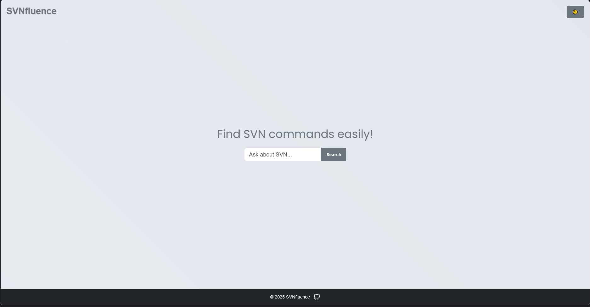

# 🚀 SVNfluence - AI-Powered SVN Command Generator

Welcome to **SVNfluence**, an AI-driven web application that helps developers quickly find and understand SVN (Subversion) commands using natural language queries. Built with Go, Gin, and powered by OpenAI, SVNfluence offers a sleek, responsive interface with a modern design, making it easy to navigate SVN commands in both light and dark themes.

🌟 **Find the SVN command you need now—effortlessly!**

---

## ✨ Features

- **AI-Powered Search**: Enter natural language queries (e.g., "how to add a file?") and get instant SVN command suggestions with descriptions, usage, and examples.
- **Responsive Design**: Beautiful, user-friendly UI with light and dark themes, featuring animated particle effects for a dynamic background.
- **Fast Performance**: Built with Go and Gin for high-speed, reliable web serving.
- **Cross-Platform**: Works seamlessly in browsers on desktop and mobile devices.
- **Open Source**: Contribute, fork, or customize—check out the code on GitHub!

---

## 📸 Screenshots

| Light Mode                                     | Dark Mode                                     |
|------------------------------------------------|-----------------------------------------------|
|  |  |

---

## 🚀 Getting Started

### Prerequisites

- **Go**: Version 1.20 or higher (install via [golang.org](https://golang.org/dl/))
- **OpenAI API Key**: Sign up at [OpenAI](https://platform.openai.com/signup) and get an API key.
- **Git**: For cloning the repository (install via [git-scm.com](https://git-scm.com/downloads))

### Installation

1. Clone the repository:

    ```bash
    git clone https://github.com/k1lgor/svnfluence.git
    cd svnfluence
    ```

2. Set your OpenAI API key as an environment variable:

    ```bash
    export OPENAI_API_KEY=your-api-key-here
    ```

3. Install dependencies:

    ```bash
    go mod tidy
    ```

4. Run the application:

    ```bash
    go run cmd/main.go
    ```

5. Open the browser and visit:

    ```bash
    http://localhost:8080
    ```

---

## 🛠 Usage

1. Navigate to the homepage and enter a query like “how to add a file?” in the search bar.
2. Click “Search” to get AI-generated SVN command suggestions, including the command, description, usage, and examples.
3. Toggle between light 🌞 and dark 🌙 themes using the button in the top-right corner.
4. Click the GitHub icon in the footer to visit the project’s repository or the developer’s profile.

---

## Project Structure

SVNfluence is organized for scalability and maintainability:

```bash
svnfluence/
├── cmd/                  # Entry point for the application
│   └── main.go          # Main application startup
├── internal/             # Internal application logic
│   ├── api/             # API handlers and routes
│   │   └── handlers.go  # HTTP handlers
│   ├── config/          # Configuration settings
│   │   └── config.go    # Configuration loader
│   ├── models/          # Data structures
│   │   └── command.go   # Command struct
│   └── openai/          # AI integration
│       └── openai.go    # OpenAI API calls
├── templates/            # HTML templates
│   ├── search.html
│   └── results.html
├── static/               # Static assets (CSS, JS, images)
│   └── style.css
├── go.mod               # Go module file
└── go.sum               # Go dependencies
```

## 🐳 Docker

Run SVNfluence in a container for easy deployment:

### Prerequisites

- **Docker**: Install Docker from [docker.com](https://www.docker.com/get-started)

### Build and Run

1. Build the Docker image:

    ```bash
    docker build -t svnfluence:latest .
    ```

2. Run the container with your OpenAI API key:

    ```bash
    docker run -d -p 8080:8080 -e OPENAI_API_KEY=your-api-key-here svnfluence:latest
    ```

### Health Check

SVNfluence includes a health endpoint at `/health`. The Dockerfile includes a `HEALTHCHECK` to monitor the app:

```dockerfile
HEALTHCHECK --interval=30s --timeout=3s \
    CMD curl -f http://localhost:8080/health || exit 1
```

## ⚠️ License

SVNfluence is open-source software licensed under the MIT License. See the [LICENSE](LICENSE) file for details.
